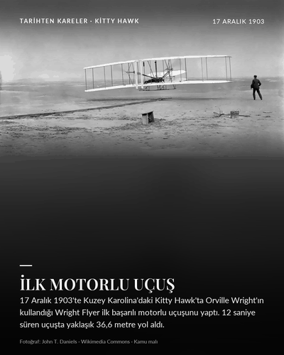
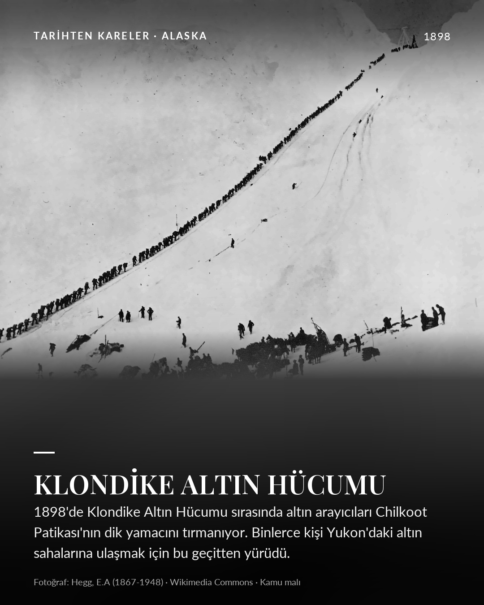
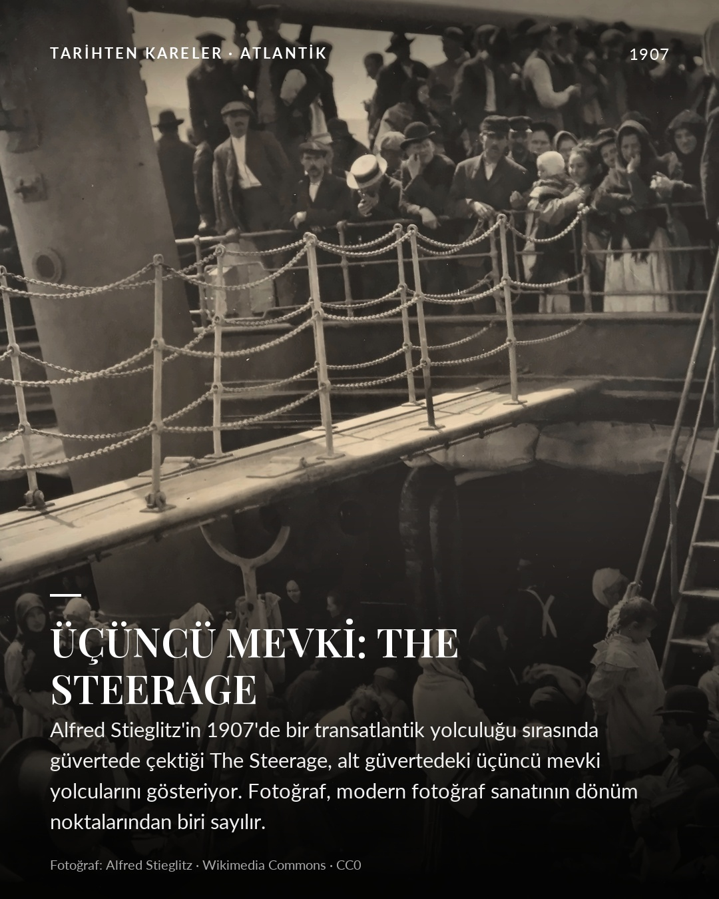
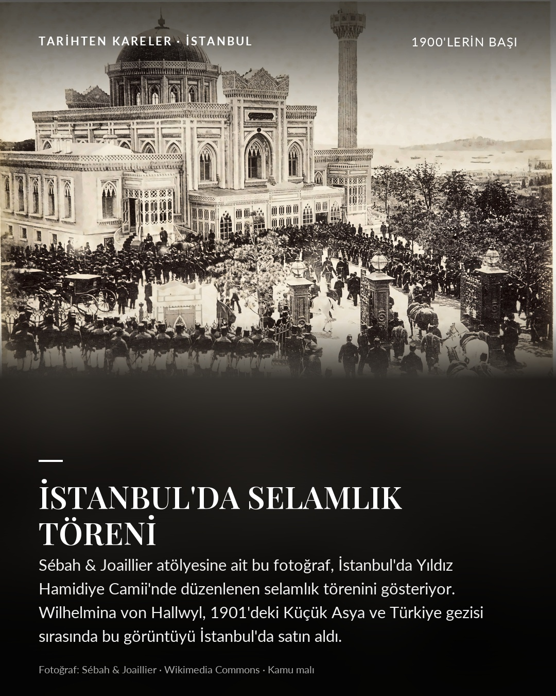
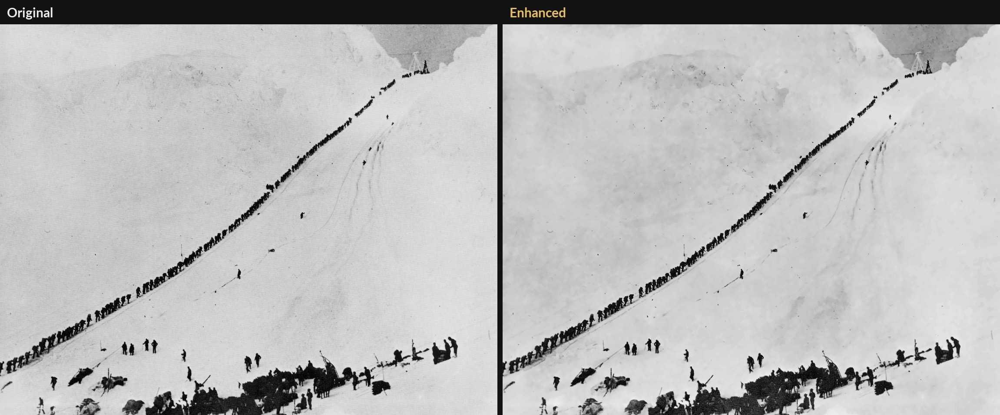

# historical-photo-posts

[](https://github.com/Opporhan/historical-photo-posts/actions/workflows/ci.yml)


🇬🇧 [English README](README.md)

**Telifsiz, siyah-beyaz tarihi fotoğrafları** bulur, hak durumunu **kanıtla** denetler, orijinale sadık kalarak
iyileştirir ve **Instagram (4:5)** ile **TikTok/Reels (9:16)** için başlıklı, kısa metinli, paylaşıma hazır görsellere
(ve kısa videolara) dönüştürür. Türkçe ve İngilizce caption, alt metin ve kaynak bilgisiyle birlikte.



<p align="center">
  
  
  
</p>



*Klondike Altın Hücumu, 1898: özgün tarama (solda) ve postta kullanılan iyileştirilmiş hâli (sağda).*

## İçindekiler

[Neden](#neden) · [Özellikler](#özellikler) · [Hızlı başlangıç](#hızlı-başlangıç) · [Komutlar](#komutlar) ·
[`posts.yaml` rehberi](#postsyaml-rehberi) · [Çıktı](#her-post-için-çıktı) ·
[Haklar nasıl doğrulanıyor?](#haklar-nasıl-doğrulanıyor) · [Proje yapısı](#proje-yapısı) ·
[Sınırlamalar](#sınırlamalar) · [Geliştirme](#geliştirme) · [Sık sorulanlar](#sık-sorulanlar)

## Neden

Tarihi fotoğraflar sosyal medyada ilgi görür, ama "eski, o hâlde serbest" varsayımı tehlikelidir: bir fotoğraf
ABD'de kamu malı olup Türkiye'de ya da AB'de hâlâ korunuyor olabilir; üstelik bir sitedeki "public domain" etiketi
yalnızca yükleyenin beyanıdır. Bu proje hak sorusunu sürecin bir parçası yapar: bir post ancak kanıt (kamu malı
şablonu, Wikidata'dan yazarın ölüm yılı, ABD durumu) tuttuğunda üretilir ve kanıt her çıktının yanında saklanır.

## Özellikler

| Adım | Ne yapar |
|---|---|
| **Bul** | Wikimedia Commons (metin ya da kategori taraması), NASA, Smithsonian ve The Met'te arar; ücretsiz anahtarla Europeana ve NARA. Logo, harita, belge, renkli fotoğraf ve konu dışı sonuçları eler; insanın seçmesi için numaralı bir önizleme sayfası (contact sheet) üretir. |
| **Doğrula** | Commons lisans şablonlarını ve yazarın ölüm yılını (Wikidata) okur, ABD'nin 95 yıllık sınırını ve "yazarın ölümünden 70 yıl" kuralını uygular; her postu `verified`, `us-only` ya da `unverified` olarak işaretler. Yalnızca `verified` olanlar üretilir. |
| **İyileştir** | Hafif gürültü azaltma, kontrast ve keskinleştirme; düşük çözünürlüklü kaynaklarda Real-ESRGAN (hafif sonuçla karıştırılarak). **Renklendirme, yüz yeniden çizimi ve boşluk doldurma yok.** Her post için `before_after.jpg` yazılır. |
| **Tasarla** | 1080×1350 ve 1080×1920 görseller: tam kadraj fotoğraf, alt gradyan, harf aralıklı etiket, yüksek kontrastlı serif başlık (Playfair Display, Türkçe'ye duyarlı büyük harf), 3–5 satır metin ve küçük "fotoğraf · kaynak · lisans" satırı. TikTok/Reels güvenli alanına uyar. |
| **Caption** | Türkçe `caption.txt` ve İngilizce `caption_en.txt`: kredi, kaynak, lisans, hashtag ve alt metin. İsteğe bağlı Claude taslağı ve iddia kontrolü. |
| **Metin doğrula** | Metindeki iddiaları ücretsiz MediaWiki API'siyle Wikipedia'ya karşı kontrol eder; API anahtarı gerekmez. |
| **Video** | Her post için 8 saniyelik yavaş yakınlaşmalı `reels_tiktok.mp4` (`ffmpeg` gerekir). |
| **İncele** | `histposts review` HTML sayfası yazar; `histposts doctor` yayın öncesi kontrol listesidir. |

Araç **hiçbir şeyi kendisi paylaşmaz**: çıktıyı inceler, paylaşımı siz yaparsınız.

## Hızlı başlangıç

```bash
git clone https://github.com/Opporhan/historical-photo-posts.git
cd historical-photo-posts
python -m venv .venv && source .venv/bin/activate
pip install -e ".[dev]"
./scripts/install_realesrgan.sh              # isteğe bağlı: düşük çözünürlük için yapay zekâ ile büyütme
export HISTPOSTS_CONTACT="siz@ornek.org"     # User-Agent'ta gider; Wikimedia istemcilerin kendini tanıtmasını ister

histposts verify posts.yaml                  # hangi postların hakları doğrulanmış?
histposts build posts.yaml --video           # -> paylasima-hazir/NN-ad/...
histposts review                             # -> paylasima-hazir/index.html
histposts doctor posts.yaml                  # son kontrol
```

`HISTPOSTS_CONTACT` yalnızca Wikimedia'ya User-Agent başlığında gönderilir, hiçbir dosyaya yazılmaz.

## Komutlar

| Komut | Amaç |
|---|---|
| `histposts search "Wright brothers" --before 1935` | Aday bulur (`output/<sorgu>/contact.jpg` + `candidates.json`). `--allow-color` verilmedikçe renkli fotoğraflar elenir. |
| `histposts search "street" --category "Black and white photographs of Amsterdam"` | Bir Commons kategorisini tarar. |
| `histposts check posts.yaml` | Hızlı `safe` / `review` / `blocked` lisans raporu. |
| `histposts verify posts.yaml --write docs/license-audit.md` | Kaynak bağlantılı, kanıta dayalı hak kontrolü. |
| `histposts build posts.yaml` | Tüm postları üretir. Seçenekler: `--only AD…`, `--strict`, `--video`, `--enhance auto\|gentle\|esrgan`, `--allow-unverified` (önerilmez). |
| `histposts facts facts.yaml --write docs/fact-check.md` | Metin iddialarını Wikipedia ile kontrol eder (anahtarsız). |
| `histposts doctor posts.yaml` | Dosyalar, doğrulanmış haklar, metin uzunlukları, kaynak çözünürlüğü, eski klasörler. |
| `histposts review` | Her postu lisans kanıtıyla yan yana gösteren HTML sayfası. |
| `histposts caption "Dosya.jpg" --topic "…"` | İsteğe bağlı Claude caption taslağı (`pip install -e ".[captions]"` ve `ANTHROPIC_API_KEY` gerekir). |

## `posts.yaml` rehberi

```yaml
posts:
- name: klondike-1898
  file: Miners climb Chilkoot.jpg        # Wikimedia Commons dosya adı
  year: '1898'                           # sağ üstte gösterilir
  title: Klondike Altın Hücumu           # büyük serif başlık
  place: Alaska                          # üst etikette gösterilir
  info: 1898'de Klondike Altın Hücumu sırasında ...   # görselin üzerindeki 3-5 satırlık metin
  story: |                               # caption.txt için daha uzun Türkçe metin
    ...
  title_en: The Klondike Gold Rush       # isteğe bağlı: caption_en.txt için İngilizce başlık/metin
  story_en: |
    ...
  tags: ['#altınhücumu', '#klondike']
  author_qid: Q5385972                   # yazarın Wikidata kimliği; ölüm yılı buradan okunur
  # author_died: anonymous               # elle alternatif; rights_source: <url> zorunlu.
  # rights_source: https://...           #   "anonymous" yalnızca 126 yıldan eski eserler için kabul edilir
  credit: ...                            # isteğe bağlı: Commons yazarı fotoğrafçı değilse kredi satırı
  crop: [0, 0, 1, 0.93]                  # isteğe bağlı: (sol, üst, sağ, alt) oranları; albüm/çerçeve kenarını keser
  focus: [0.5, 0.4]                      # isteğe bağlı: fotoğraf kırpılırken kadrajda kalacak nokta
  series: klondike                       # isteğe bağlı: aynı seriye ait postlar "01 / 05" sayacı alır
  alt_text: ...                          # isteğe bağlı: erişilebilirlik metni (yoksa otomatik üretilir)
```

`facts.yaml` her post için fotoğrafın kendi kaydını aşan iddiaları, onları desteklemesi gereken Wikipedia makalesini
ve makalede geçmesi gereken ifadeleri (tarih, sayı, isim) listeler.

## Her post için çıktı

```
paylasima-hazir/01-paris-1913/
├── instagram_4x5.jpg        # 1080×1350
├── tiktok_9x16.jpg          # 1080×1920, metin Reels/TikTok güvenli alanında
├── reels_tiktok.mp4         # --video ile
├── before_after.jpg         # özgün ve iyileştirilmiş hâl
├── caption.txt              # Türkçe caption: hikâye, hashtag, kredi, kaynak, lisans, alt metin
├── caption_en.txt           # İngilizce caption (story_en'den)
└── license_evidence.json    # şablonlar, yazarın ölüm yılı, kaynaklar, kaynak çözünürlüğü
```

## Haklar nasıl doğrulanıyor?

`build` bir postu yalnızca hakları **doğrulanmışsa** (`verified`) üretir:

1. Kaynak sayfada kamu malı / CC0 şablonu var;
2. yazarın ölümünden 70 yıl geçmiş: ölüm yılı Wikidata'dan (`author_qid`), ya da `rights_source` bağlantılı elle
   girilmiş `author_died`, ya da en az 126 yıllık anonim eser;
3. ABD'de kamu malı: CC0 ya da 95 yıllık sınırdan önce (2026'da 1931 öncesi) tarihlenmiş.

Bunun dışındaki her şey `us-only` ya da `unverified` olur ve atlanır; böyle bir postun eski çıktı klasörü silinir.
Örnek 19 postun hepsi doğrulanmıştır; her kaynak bağlantısı [docs/license-audit.md](docs/license-audit.md) içinde.

Örnek: Dorothea Lange'in "Göçmen Anne" fotoğrafı ABD federal kurum işi olduğu için ABD'de serbesttir, ama Lange
1965'te öldüğü için Türkiye'de hâlâ korunur. Bu yüzden böyle bir post **üretilmez**.

Bu bir **risk filtresidir, hukuki tavsiye değildir**: şablonlar topluluk beyanıdır, "tarih" bir yayın değil çekim yılı
olabilir, Wikidata da yanılabilir. Ayrıntılar ve sınırlar: [docs/licensing.md](docs/licensing.md),
[docs/text-verification.md](docs/text-verification.md), [docs/fact-check.md](docs/fact-check.md).

## Proje yapısı

```
src/histposts/
  cli.py          komutlar             pipeline.py   posts.yaml okuma ve post başına üretim
  sources/        her fotoğraf         licensing.py  safe/review/blocked sınıflandırma
                  kaynağı için modül   verify.py     kanıta dayalı hak kontrolü (Commons + Wikidata)
  photocheck.py   fotoğraf olmayan     factcheck.py  Wikipedia iddia kontrolü
                  ve renkli tespiti    compose.py    post tasarımı ve fontlar
  enhance.py      iyileştirme          video.py      yavaş yakınlaşmalı MP4
  imageprep.py    kenar kırpma         review.py     HTML inceleme sayfası
  captions.py     isteğe bağlı Claude  doctor.py     yayın öncesi kontrol listesi
posts.yaml        19 örnek post        facts.yaml    kontrol edilecek iddialar
docs/             mimari, lisans, denetim raporları, demo GIF
tests/            testler (ağ çağrıları taklit edilir)
```

Veri akışı için [docs/architecture.md](docs/architecture.md).

## Sınırlamalar

* Kongre Kütüphanesi sitesi otomatik istemcilere Cloudflare doğrulaması gösterir, bu yüzden kaynak olarak
  kullanılamaz; fotoğrafları Commons kopyaları ve orada alıntılanan kayıt üzerinden kullanılır. Europeana ve NARA
  anahtar olmadan atlanır.
* Real-ESRGAN inandırıcı ama uydurma ayrıntı üretebilir; bu yüzden yalnızca düşük çözünürlükte, hafif sonuçla
  karıştırılarak kullanılır ve her zaman önce/sonra görseli eşlik eder. Caption'lar görselin dijital olarak
  iyileştirildiğini belirtir.
* Tarama içindeki basılı yazılar ve albüm/çerçeve kenarları otomatik algılanmaz; `posts.yaml`'da `crop:` kullanın.
* Fotoğraf ve renk tespiti sezgiseldir; asıl kontrol önizleme sayfasıdır. Tonlu baskılar (sepya) kabul edilir.
* Instagram/TikTok API'siyle otomatik paylaşım kapsam dışıdır (Instagram Business hesabı ve uygulama incelemesi
  ister; TikTok denetimden geçmeyen uygulamalara yalnızca özel paylaşıma izin verir).
* Wikipedia kontrolü anahtar ifadelerin makalede geçtiğini doğrular; ifadenin doğruluğuna karar vermez.

## Geliştirme

```bash
pip install -e ".[dev]"
ruff check src tests && ruff format --check src tests
pytest
```

macOS'ta sanal ortamdaki bir `.pth` dosyası *gizli* bayrağı alabilir; Python 3.13+ onu yok sayar ve `import histposts`
başarısız olur. Çözüm: `chflags -R nohidden .venv` ya da `PYTHONPATH=src` ile çalıştırın.
Katkı için [CONTRIBUTING.md](CONTRIBUTING.md).

## Sık sorulanlar

**Ürettiği görselleri doğrudan paylaşabilir miyim?** Önce `histposts doctor` ve `histposts verify` temiz olmalı;
sonra `paylasima-hazir/index.html` sayfasında her postu gözle kontrol edin. Caption'daki kaynak ve lisans
satırlarını silmemenizi öneririm.

**Kendi fotoğrafımı ekleyebilir miyim?** Şimdilik kaynaklar Wikimedia Commons ve açık arşivler. Kendi fotoğrafınız
için `posts.yaml` yapısı Commons dosya adı bekler; başka kaynak eklemek için `src/histposts/sources/` altına bir
modül yazın (`Candidate` döndürsün).

**Neden renkli fotoğraf yok?** Proje siyah-beyaz tarihi fotoğraflara odaklıdır; `search` renkli olanları eler.
İsterseniz `--allow-color` kullanabilirsiniz, ama `build` renkli kaynağı yine de atlar.

**Renklendirme yapıyor mu?** Hayır. Renklendirme, yüz onarımı ve boşluk doldurma bilinçli olarak yok; iyileştirme
yalnızca gürültü, kontrast ve keskinlik düzeyinde kalır ve her zaman önce/sonra görseli üretilir.

## Lisans

Kod MIT lisanslıdır. Pakete dahil Lato ve Playfair Display fontları SIL Open Font License altındadır
(`src/histposts/assets/fonts/`). Real-ESRGAN BSD-3-Clause lisanslıdır ve gerektiğinde indirilir, dağıtılmaz.
Örnek fotoğraflar kamu malıdır; her birinin kanıtı `examples/*/license_evidence.json` içindedir.
