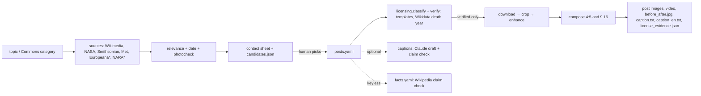

# Architecture

`*` needs a free API key.

| Module | Responsibility |
|---|---|
| `http.py` | User-Agent from `HISTPOSTS_CONTACT`, ≤3 concurrent requests, retry/backoff on 429/5xx |
| `sources/` | One module per source, all returning `Candidate` |
| `photocheck.py` | Rejects logos, maps, documents and other non-photographs |
| `licensing.py` | `safe` / `review` / `blocked` classification and evidence record |
| `verify.py` | Evidence-based `verified` / `us-only` / `unverified` check (Commons templates, Wikidata death year) |
| `factcheck.py` | Keyless claim check against Wikipedia |
| `video.py`, `review.py`, `doctor.py` | Slow-zoom MP4, HTML review page, pre-publication checklist |
| `imageprep.py` | Scan-border trimming and fractional crops |
| `enhance.py` | Gentle OpenCV restoration; Real-ESRGAN for low-resolution sources; before/after image |
| `compose.py` | Post layout with TikTok/Reels safe areas (bundled Playfair Display and Lato fonts) |
| `captions.py` | Grounded Turkish caption drafts with a claim-verification pass |
| `pipeline.py` | `posts.yaml` loading and the per-post build |
| `cli.py` | `search`, `check`, `verify`, `build`, `facts`, `doctor`, `review`, `caption` |

Design choices: a human picks the photo and approves the text (the tool never publishes), enhancement is
deliberately conservative (no colorization, no face reconstruction, no inpainting), and license decisions are
stored next to every output.
